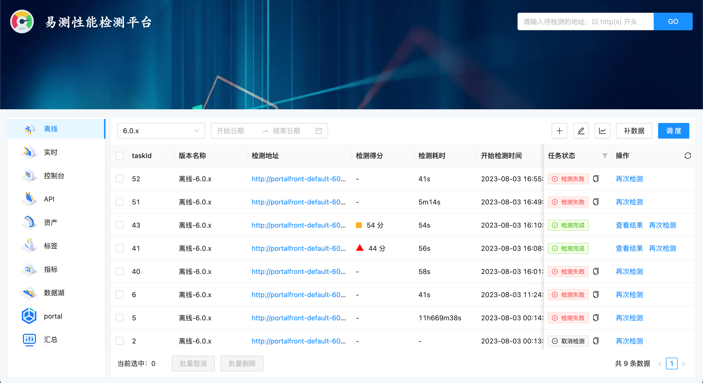

  

易测性能检测平台

## 首页效果

  

## 本地启动

### mysql 5.7

建表语句: `/src/mysql/base-table.sql`

### 基础依赖

- pnpm：v6.32.20
- node：v14.20.0
- pm2：v5.2.0

`.env` 文件中的属性按实际填写即可

- 运行页面：`pnpm dev:web`，7001 端口
- 运行 node 服务：`pnpm dev`，4000 端口

## 部署文档

[部署文档](./DEPLOY.md)

## 功能点

- [x] 页面检测
- [x] 定时运行任务
- [x] 补数据
- [x] 查看报告（lighthouse 生成的文件）
- [x] 任务失败钉钉告警
- [x] 性能趋势图
- [ ] 数据周报
- [ ] UI 布局优化
- [ ] docker 部署

**注意**
> 易测检测系统和我司内部的 devops 系统绑定用于测试需要登录的页面，但不影响功能借鉴。
