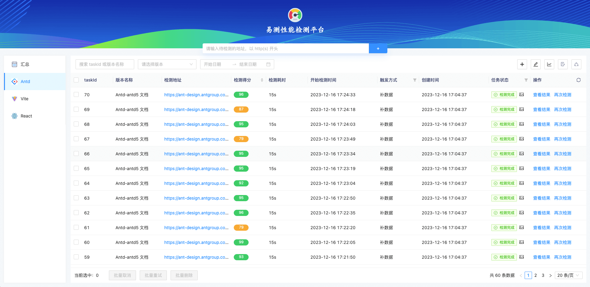

  

易测性能检测平台

## 首页效果

  

## 本地启动

### mysql 5.7

建表语句: `/src/mysql/base-table.sql`

### 基础依赖

- pnpm：v6.32.20
- node：v14.20.0
- pm2：v5.2.0

`.env` 文件中的属性按实际填写即可

- 安装服务依赖：`pnpm i`
- 安装页面依赖：`cd website && pnpm i`
- 运行 node 服务：`pnpm dev`，4000 端口
- 运行页面：`pnpm web`，7001 端口

## 部署文档

[部署文档](./DEPLOY.md)

## 功能点

- [x] 页面检测
- [x] 定时运行任务
- [x] 补数据
- [x] 查看报告
- [x] 任务失败钉钉告警
- [x] 性能趋势图
- [x] 权限控制
- [x] 支持测试服部署
- [ ] 数据周报
- [ ] docker 部署

**数据周报**功能依赖 canvas 模块，该模块需要一些先行安装的依赖，详情见：[node-canvas wiki](https://github.com/Automattic/node-canvas/wiki)。比如 CentOS 需要先执行 `yum install gcc-c++ cairo-devel pango-devel -y`，MacOS 需要先执行 `brew install pkg-config cairo pango libpng`。

**注意**
> 易测检测系统和我司内部的 devops 系统深度绑定，用于检测我司需要登录的一些页面，但不影响评分功能的实现参考。
